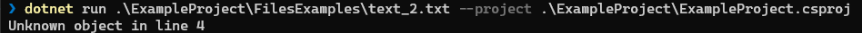

# CREATE_GEOMETRIC_OBJECTS

Данное консольное приложение помогает создавать геометрические объекты требуемого типа по параметрам, заданным в текстовом файле.

### Структура приложения

```
 ExampleProject/
        FilesExamples/
                text_1.txt
                text_2.txt
                text_3.txt
        Program.cs
        ExampleProject.csproj
 GeometryObjectsShared/
        GeometricObjects/
                Circle.cs
                FourSquare.cs
                Line.cs
                Point.cs
                Rect.cs
                Rhomb.cs
        Creator.cs
        IGeometricObject.cs
        GeometryObjectsShared.shproj
        GeometryObjectsShared.projitems
 CreateGeometricObjects.sln
```

Приложение состоит из 2-х .NET проектов:

- общего проекта (**GeometricObjetsShared**), на который ссылается консольное приложение;
- консольного приложения (**ExampleProject**), выводящего результат в терминал.

### Классы геометрических объектов (проект GeometryObjectsShared)

Классы создаются с помощью статического класса **Creator** на основе интерфейса **IGeometricObject**. На текущий момент проект реализует создание объектов следующих классов:

1. **Circle** - круг, описывается координатами центра и радиусом.
2. **FourSquare** - квадрат, описывается координатами левой нижней точки и длиной стороны.
3. **Line** - прямая, описывается координатами двух точек, через которые она проходит.
4. **Point** - точка, описывается координатами.
5. **Rect** - прямоугольник, описывается координатами левой нижней точки и правой верхней точки.
6. **Rhomb** - ромб, описывается координатами центра (пересечение диагоналей), высотой и шириной.

Каждый класс реализует следующие методы:

- **Draw** - выводит в консоль название типа объекта и его основные параметры, например:

```
роint at (10, 20)
circle at (-100, 300), rаdius = 50
rect at (100, 200), (200, 300)
```

- **Perimeter** - возвращает периметр объекта, выводит в консоль название типа объекта и его периметр, например:

```
circle: perimeter = 60.34
```

- **Square** - возвращает площадь объекта, выводит в консоль название типа объекта и его площадь, например:

```
circle: square = 40.15
```

#### **Важно!** Для объектов **_прямая_** и **_точка_** методы **Perimeter** и **Square** возвращают всегда **0**. Для объекта **_круг_** метод **Perimeter** возвращает **длину окружности** заданного круга.

Экземляр каждого класса создаётся через статический метод **_Create(string input)_** статического класса **Creator** путём передачи в метод определённой строки для каждого типа объекта.
Формат строки для:

1. **Circle**: сirclе x y r
2. **FourSquare**: square x y l
3. **Line**: linе x1 x2 x2 y2
4. **Point**: роint x y
5. **Rect**: rеct x1 y1 x2 y2
6. **Rhomb**: rhomb x y h w

#### **Важно!** При считывании строки разделителем целой и дробной части в числовых параметрах является **точка(.)**.

### Запуск приложения через командную строку

Для запуска приложения необходимо передать путь к файлу с описанными объектами в качестве параметра командной строки. В директории **_ExampleProject\FilesExamples_** есть 3 примера таких файлов.

Запуск из корневой директории репозитория:

```
dotnet run .\ExampleProject\FilesExamples\text_1.txt --project .\ExampleProject\ExampleProject.csproj
```

Запуск из директории проекта (ExampleProject):

```
dotnet run .\FilesExamples\text_1.txt
```

### Запуск приложения через Visual Studio 2022

Для запуска через **_Visual Studio 2022_** откройте файл решения - **_CreateGeometricObjects.sln_**.

Укажите путь к файлу с описанными объектами через **_Профили запуска_** (Откладка -> Свойства откладки для проекта ExampleProject -> Аргументы командной строки).


Путь к файлу лучше передать как абсолютный.

Далее, как обычно, запускаем с откладкой (F5) или без (CTRL+F5) проект ExampleProject.

### Результаты работы приложения (ExampleProject)

Приложение выводит в консоль результаты в следущем виде (пример для **text_1.txt**):


Если в файле находились дубликаты каких-либо объектов, то приложение их выведет (пример для **text_3.txt**):


Также приложение игнорирует строки в файле, начинающиеся с **"# "**. Объекты, указанные в этих строках, создаваться не будут. Пример такого файла - **text_2.txt**:


В процессе считывания данных из файла могут возникнут следующие ошибки:

- Неправильно заданные параметры для конкретного объекта:


- Объект, описанный в файле, не соответствует ни одному типу, описанному в библиотеке:


